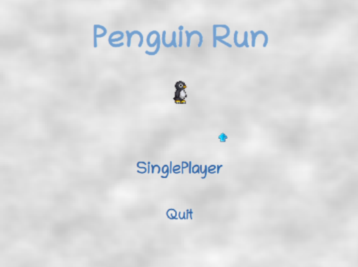
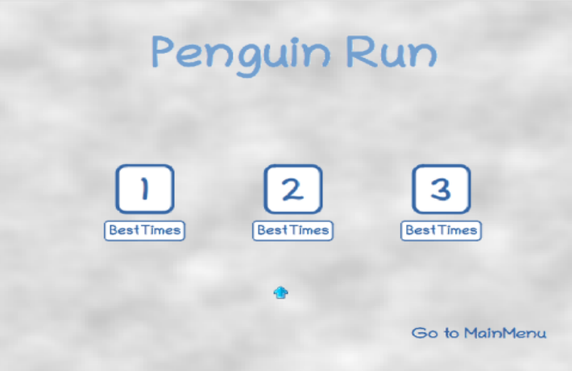
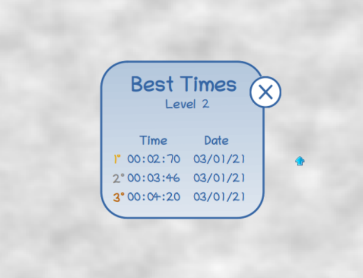
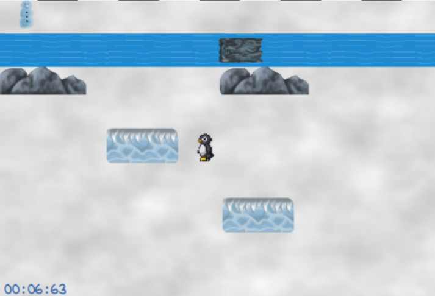
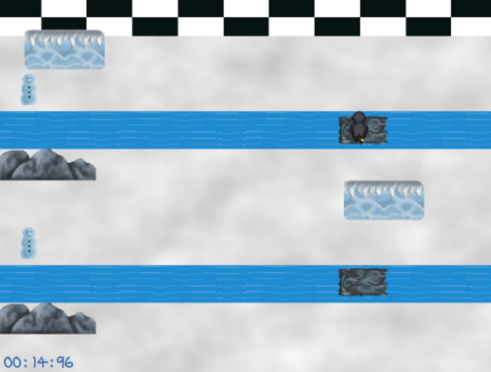
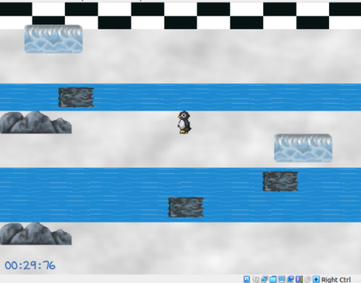
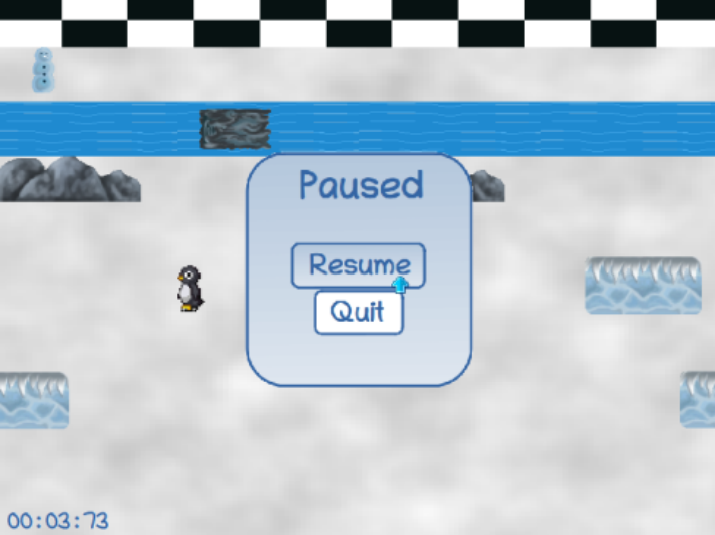
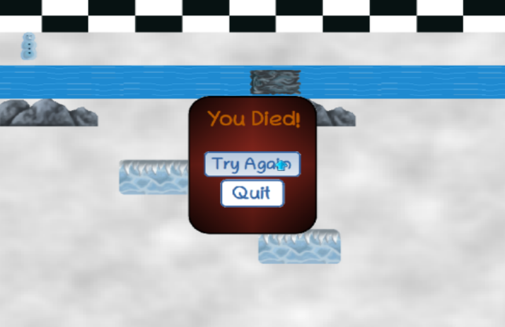
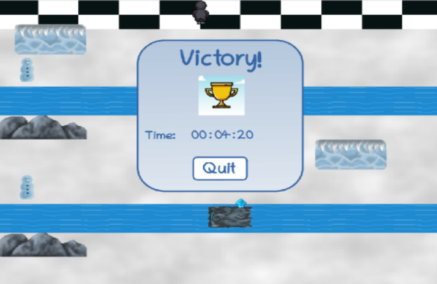

# FEUP-LCOM
**Description** - Labs and final project "Penguin Run", a platform game inspired by SuperTux and Crossy Road

**Course** - Computer Laboratory

## Project Overview

Penguin Run is a platform game with a design inspired by SuperTux, where a penguin needs to get from one end of the scenery to another without falling in the water or colliding with obstacles. This game makes use of the UNIX systems' timer, keyboard, mouse, video card, and RTC, which had to be manually programmed and tuned.

## Usage

In a minix based system compile the source code using the provided Makefile and then execute the resulting binary.

## Game Screenshots

### Menus
| Main Menu | Levels Menu | ScoreBoard
|------| ----| --- |
|   |   | 

### Gameplay

| Level 1 | Level 2| Level 3
|------| ----| --- |
|   |   | 

| Pause Menu | Death Menu | Victory Menu
|------| ----| --- |
|   |   | 
